# Crowdfunding_ETL

**Project Overview** 

The goal of this project is to *extract* data from Excel files, *transform* the data into a structured format, *create* a relational database, and load the *transformed* data into it.

## Data Extraction and Transformation

**Category and Subcategory DataFrames:**

In this project we extracted *categories and subcategories* from the 'category & sub-category' column in the crowdfunding Excel file provided in resources folder.

**Created Category DataFrame** which Contains *category_id* and *category names*. There are total *9* categories in the dataframe. 

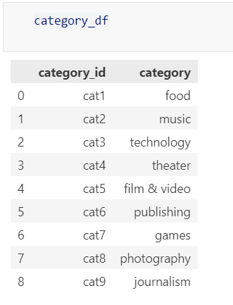

**Created Subcategory DataFrame** which Contains *subcategory_id* and *subcategory names*. There are total *24* sub-categories in the dataframe.

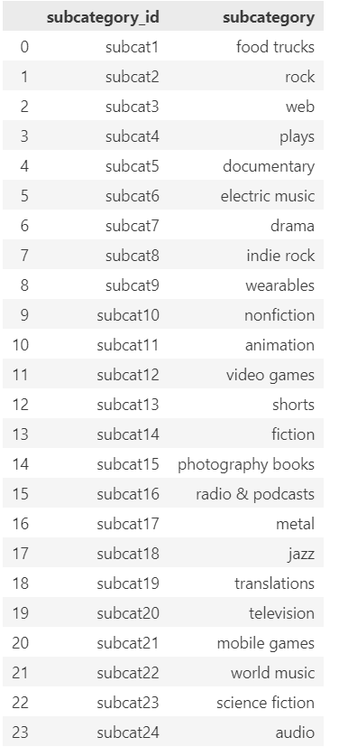

Exported these dataframes as 'category.csv' and 'subcategory.csv' separately.

**Campaign DataFrame:**

1. *Transformed* the crowdfunding data by renaming the columns 'blurb' to 'description', 'launched_at' to 'launch_date', 'deadline' to 'end_date'.
    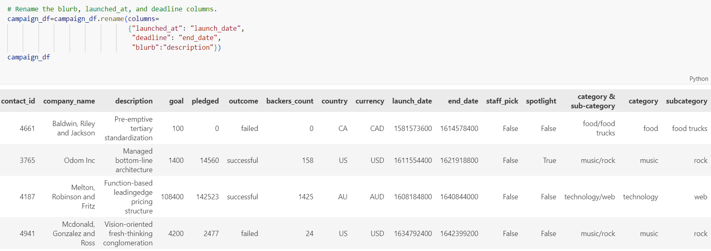

2. *Converted* 'goal' and 'pledged' to float type.
    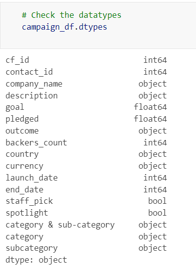

3. *Converted* 'launch_date' and 'end_date' from Unix timestamps to datetime format

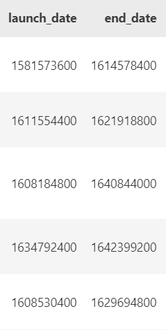

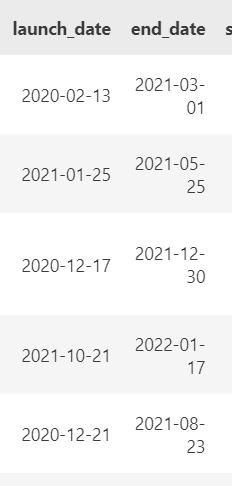

Exported the dataframe as 'campaign.csv'.

**Contacts DataFrame:**

*Extracted* contact data from the contacts Excel file.

*Created* a DataFrame with *Contact_id, First_name, last_name, email*

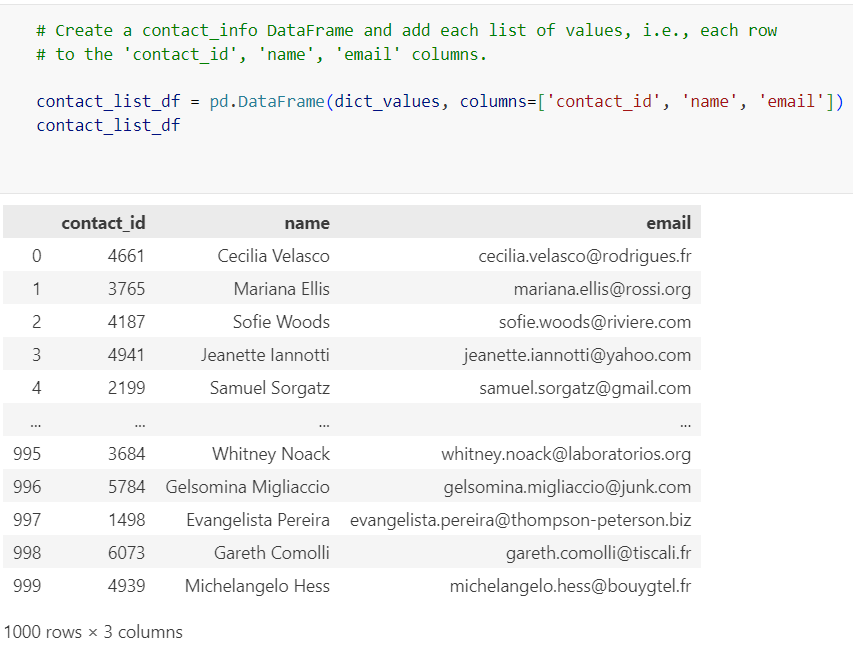

Exported data as 'contacts.csv'.

## Database Design:

**Entity Relationship Diagram (ERD):**

Designed an ERD to represent relationships between tables:
Category: Primary key is 'category_id'
Subcategory: Primary key is 'subcategory_id'
Contacts: Primary key is 'contact_id'
Campaign: Primary key is 'cf_id', with foreign keys referencing other tables

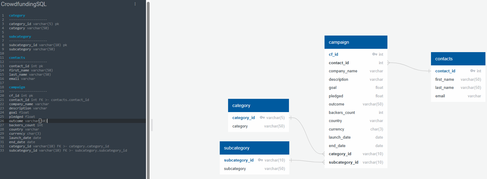

## Data Schema:
Created a *PostgreSQL database* named 'crowdfunding_db'.

Created tables and imported CSV files into their respective tables.

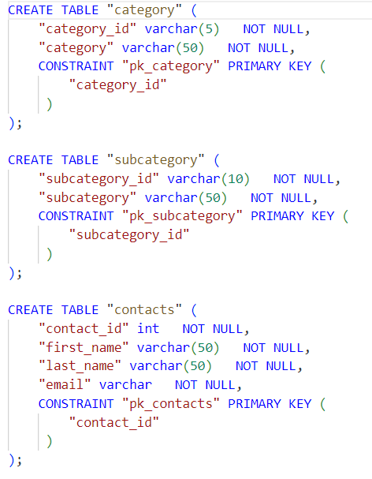
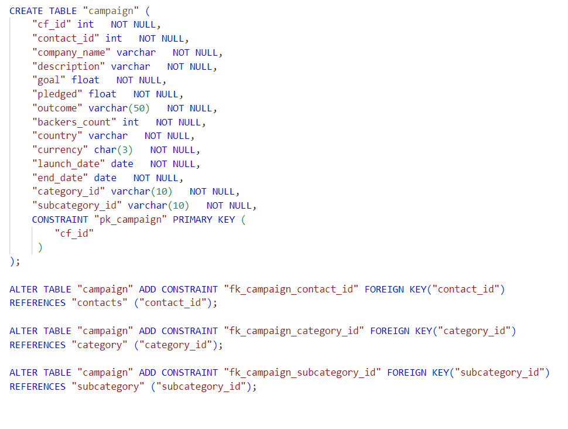

Used **Select** statements to confirm data export.

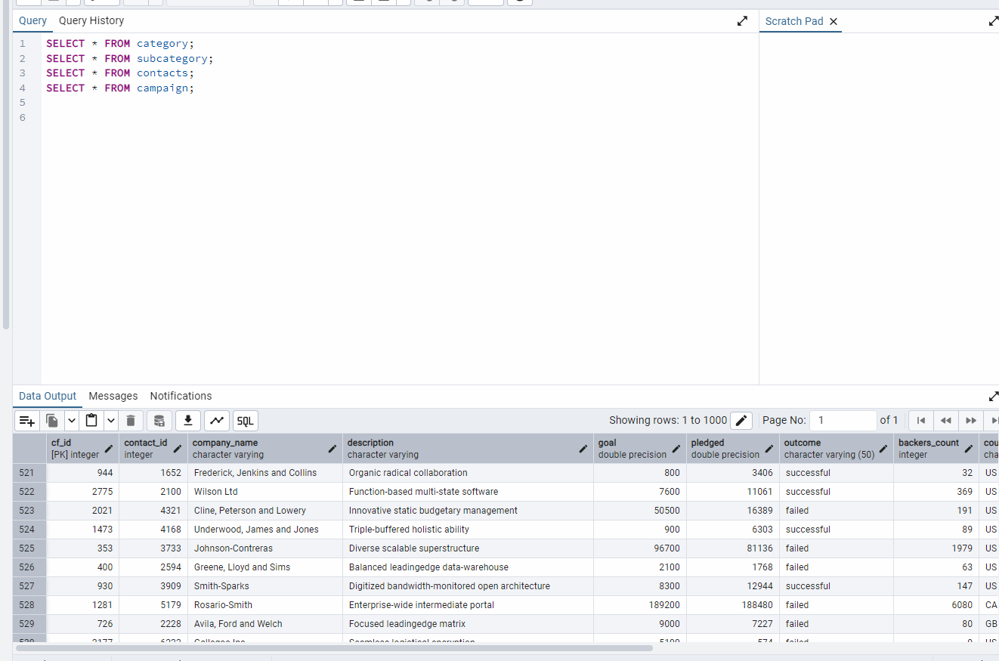

## Technologies Used:
1. Python
2. PostgreSQL
3. Jupyter Notebook
4. QuickDBD (for ERD design)

## Conclusion:
In order to complete ETL mini project there were certain steps involved which ranges from extracting raw data to loading it into a relational database. Also, creating a database which supports efficient querying of crowdfunding campaigns, categories, subcategories, and contact details.